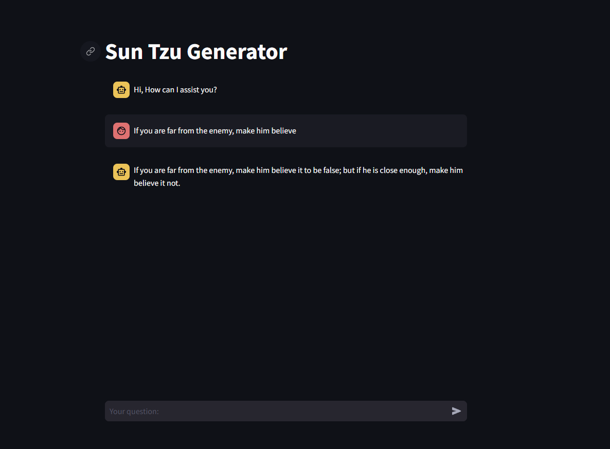

<https://classics.mit.edu/Tzu/artwar.html>

# Sun Tzu Text Generator

The Sun Tzu Text Generator is an innovative tool leveraging the strategic principles from Sun Tzu's "The Art of War". This project uses advanced natural language processing to generate strategic insights and advice.

## Overview

Inspired by "The Art of War", this text generator provides users with strategic advice and insights based on Sun Tzu's teachings, using modern natural language processing techniques.

## Features

- Text generation inspired by Sun Tzu's strategic principles.
- Finetuned GPT-2 model for text generation.
- User-friendly interface.
- Customizable content generation.

## Demo

## License

Project license information.

## Acknowledgements

- "The Art of War" by Sun Tzu, [MIT Classics](https://classics.mit.edu/Tzu/artwar.html)
